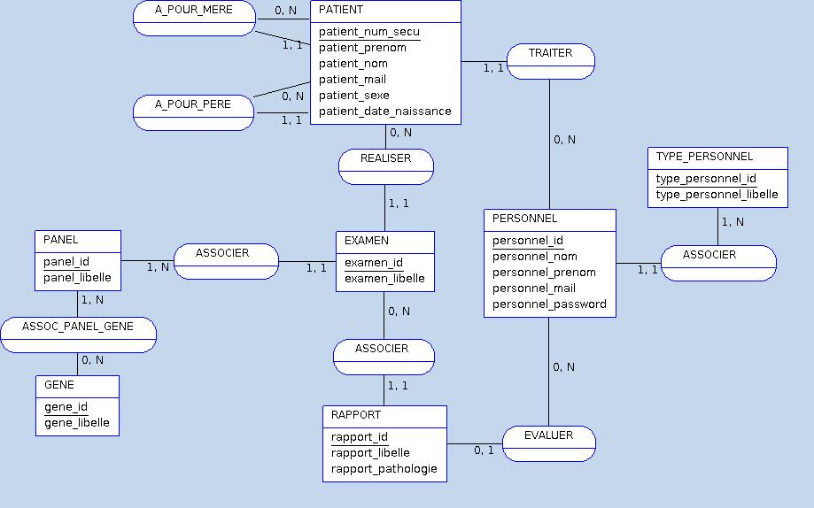

[TOC]

#Projet Base de données
__Auteurs :__ Stéphanie LEVON & Vincent ROCHER
#Introduction
##Sujet 
Le but de ce projet est de gérer des examens demandés par des prescripteurs. Un examen consistera en l'étude, pour un patient donné, d'un panel de gènes et produira un rapport/compte-rendu clinique.
##Schéma de la base

#Création des tables
## Table `Patients`
###Description
La table `Patients` est composée de 11 colonnes, et autant de lignes qu'il y a de patients.

id| num_secu | prenom | nom | mail | sexe | ethnie | date_naissance | num_tel | pere_id | mere_id
------- | :------ | :-----: | ------:


###Création de la table
``` sql

```

